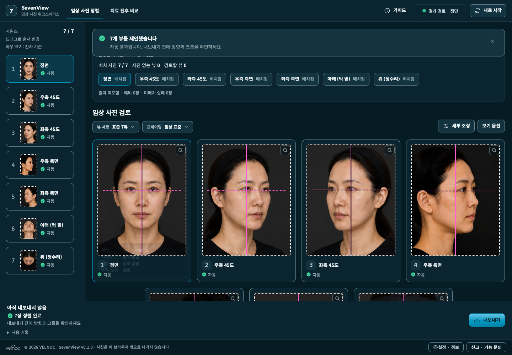
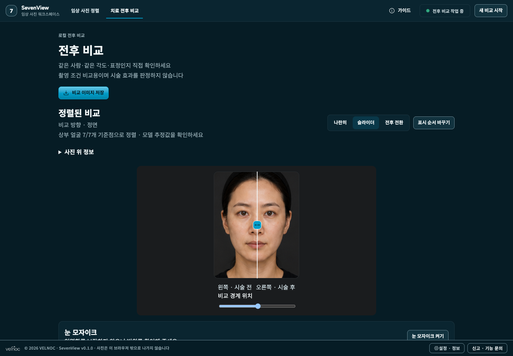

# SevenView Community

사진 정리·크롭·전후 비교를 돕는 [VELNOC](https://velnoc.com/)의 무료 오픈소스 도구입니다.
사진은 브라우저 안에서 처리하며, 가입이나 초대 코드 없이 사용할 수 있습니다.

[무료 웹앱 시작](https://sevenview.velnoc.com/app) ·
[SevenView 홈페이지](https://sevenview.velnoc.com/) ·
[English](README.md) · [상세 설치 안내](docs/INSTALLATION.md) · [사용 방법](docs/USER_GUIDE.md)



## 기능

- 7뷰 촬영 세트 자동 분류 제안, 누락·추가 사진 확인, 수동 배치
- 크롭·위치·배율·수평 조절, 검토 및 저장 상태 확인
- 나란히·슬라이더·전후 전환 비교, 수동 대응점과 확대경
- 눈 가림, 7뷰 PNG·PDF·PPTX·개별 사진 ZIP 저장
- 전후 비교 PNG·사진이 포함된 독립 HTML 저장

꼭 7장을 넣을 필요는 없습니다. 다만 눈 주변 확대·구강 사진 등은 7뷰 얼굴 사진과
다르므로 자동 인식이 어려울 수 있습니다. 면적·길이·변화율 측정이나 시술 결과 예측은
공개판에 포함되지 않습니다.

## 기존 예시 사진으로 익히기

[7방향 합성 예시 사진](public/examples)의 `01-`부터 `07-`까지 파일을 사용하세요.
실제 환자가 아닌 기존 합성 성인 인물입니다. 화면 캡처 파일은 입력 사진이 아닙니다.

1. `/app`에서 **사진 파일 선택** → 같은 세트 사진 선택 → **AI 자동 정렬**.
2. 분류·좌우·크롭을 확인하고 잘못된 부분은 사진을 선택해 직접 조절합니다.
3. 검토 후 원하는 결과 형식으로 저장하고 다운로드한 파일을 열어봅니다.
4. **치료 전후 비교**에서 사진 두 장을 선택하고 **두 사진 정렬**을 누릅니다.
5. **슬라이더**를 선택해 경계를 움직여 보세요.
6. **비교 이미지 저장** → **설명용 HTML** → **비교 파일 저장**을 선택하면
   브라우저에서 다시 열어 설명할 수 있는 파일이 저장됩니다.



이 비교 화면은 동일 사진으로 조작을 보여주는 예시이며 실제 시술 결과가 아닙니다.
내려받은 HTML에도 사진이 포함되므로 공유 전에 동의 범위를 확인하세요.

## 내 컴퓨터에서 설치

Git, Node.js 24 이상을 먼저 설치한 뒤 터미널에서 실행하세요.

```bash
git clone https://github.com/hungryangel/sevenview-community.git
cd sevenview-community
npm install -g pnpm@11.19.0
pnpm install --frozen-lockfile
pnpm dev
```

터미널에 표시된 주소(기본 `http://localhost:5173`)로 접속합니다.
`/`는 소개 페이지, `/app`은 작업 화면입니다.
설치 없이 [공개 웹앱](https://sevenview.velnoc.com/app)을 사용할 수도 있습니다.

공식 사이트는 Cloudflare Pages 정적 호스팅을 사용합니다. 개선을 위한 세 가지 고정 이벤트
횟수는 기본 집계하되 소개 페이지와 앱 설정에서 끌 수 있고 GPC/DNT를 존중합니다. 사진·파일명·
URL·쿠키·사용자 ID는 이벤트에 넣지 않으며 날짜·이벤트·합계만 90일 보관합니다. 이와 별개로
소개 페이지에만 선택형 Clarity 분석이 있고 기본값은 꺼짐입니다. 사진 앱과 다운로드 파일에는
Clarity가 적용되지 않습니다. [개인정보 안내](docs/PRIVACY.md)를 확인하세요.
기존 초대형 베타와 별도이며 초대 코드가 필요하지 않습니다.

운영용 빌드·서버 설정·오류 해결은 [설치 안내](docs/INSTALLATION.md)를 참고하세요.

## 무료 도구와 유료 지원

소스는 [AGPL-3.0-only](LICENSE)입니다. 모델·서체·상표·예시 사진은 각
[고지](THIRD_PARTY_NOTICES.md)와 [자산 안내](docs/ASSETS.md)를 확인하세요.
기관별 설치·운영·보안 요구 검토·시스템 연동·추가 개발은 유료로 상담합니다.

[유료 커스터마이징 문의](http://pf.kakao.com/_JDbbX/chat)
