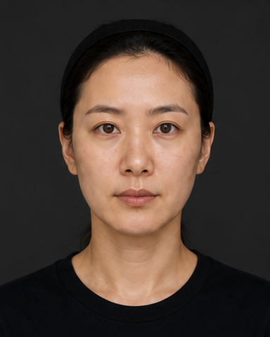
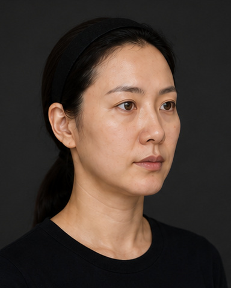
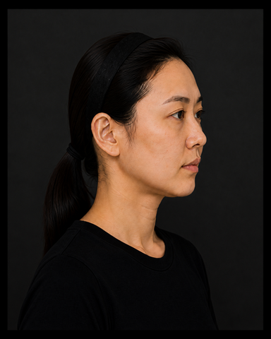

# SevenView Community

**Organize clinical photos. Align views. Explain comparisons.**

A free, local-first photo workspace by [VELNOC](https://velnoc.com/).
Arrange facial photographs into a seven-view set, review AI-assisted crops and
alignment, and export visual comparisons—all inside your browser.

[Use the free web app](https://sevenview.velnoc.com/app) ·
[Product website](https://sevenview.velnoc.com/) ·
[한국어 안내](README.ko.md) · [Installation](docs/INSTALLATION.md) ·
[User guide](docs/USER_GUIDE.md) · [Paid customization](http://pf.kakao.com/_JDbbX/chat)


*Actual Community interface, shown in Korean. All example portraits are synthetic
adults, not patients. See [asset provenance](docs/ASSETS.md).*

## What you can do

| Workflow | Included |
| --- | --- |
| Organize | AI-assisted view assignment, missing/additional photo review, manual reassignment |
| Review | Crop, position, scale and rotation adjustments; review and export status |
| Compare | Side-by-side, draggable slider, before/after toggle, paired manual reference points and magnifier |
| Prepare for sharing | Eye masking and local downloads; masking is not guaranteed anonymization |
| Export sets | Contact-sheet PNG, PDF, PPTX, individual-photo ZIP |
| Export comparisons | Comparison PNG and self-contained interactive HTML |

You do **not** need exactly seven input photos. Missing views remain unfilled;
review assignments before exporting. Recognition may fail for profiles,
occluded eyes, tight close-ups or non-facial images. Manual review is part of
the workflow, not an optional accuracy guarantee.

Community does **not** include quantitative area/length/change measurements,
clinical outcome assessment or surgical simulation. The interface currently
uses Korean; the English guide maps the main controls.

## Photo and comparison examples

<p>
  
  
  
</p>

[All seven example photos](public/examples) are included so you can try the app
without patient data. Use the seven `01-` through `07-` files, not the workspace
screenshots, as inputs.


*The same image is used on both sides to demonstrate the slider. This is not a
treatment result, improvement claim or prediction.*

## Quick start

Requirements: [Git](https://git-scm.com/downloads), [Node.js 24 or later](https://nodejs.org/en/download),
pnpm **11.19.0**, and a modern desktop browser (Chrome or Edge recommended).
No API key, account, invitation code or database is required.

```bash
git clone https://github.com/hungryangel/sevenview-community.git
cd sevenview-community
npm install -g pnpm@11.19.0
pnpm install --frozen-lockfile
pnpm dev
```

Open the URL printed by Vite (normally `http://localhost:5173`). The product
introduction is at `/`; the workspace is at `/app`.

For platform notes, production builds, static hosting and troubleshooting, read
the [complete installation guide](docs/INSTALLATION.md). Prefer no installation?
Open the [public Community app](https://sevenview.velnoc.com/app).
It is separate from the invitation-only beta and requires no invitation code.

## First use

1. Open `/app` and select **사진 파일 선택** (choose photos). Load the seven sample PNGs.
2. Select **AI 자동 정렬** (AI alignment). Wait for local model initialization.
3. Review each view, especially profile direction, framing and missing photos.
4. Export the reviewed set and open the downloaded files to confirm the result.
5. For a comparison, open **치료 전후 비교**, choose one photo per side, and press
   **두 사진 정렬**. Use **슬라이더** to drag the comparison boundary.
6. Select **비교 이미지 저장**, choose **설명용 HTML**, then **비교 파일 저장**.
   Open the downloaded HTML in a browser to use its slider without running the app.

The HTML contains the chosen photos. Treat it as a patient-containing file when
working with real clinical photos. [Detailed usage and export guide](docs/USER_GUIDE.md).

## Development and verification

```bash
pnpm typecheck
pnpm test
pnpm build
pnpm verify:community
pnpm exec playwright install chromium
pnpm exec playwright test --workers=1
```

The release guard rejects private feature families, secret-shaped content and
unapproved binary assets. Keep the [public product boundary](docs/PRODUCT_BOUNDARY.md)
intact when contributing. See [CONTRIBUTING.md](CONTRIBUTING.md).

## Privacy and scope

Selected photos and analysis results are not uploaded to an application server.
Models, WASM and fonts are served from the same origin and run locally. The host
can retain ordinary page/asset request logs. Local aggregate usage counts are
not a cloud patient record. Exported files contain photos; consent, retention and
sharing decisions remain with the operator. See [Privacy](docs/PRIVACY.md) and
[Model limitations](docs/MODEL_CARD.md).

The introduction offers optional, per-visit Clarity analytics (off by default).
The photo app and exported files never load Clarity. The official website is
hosted as static assets on Cloudflare Pages, without metered server functions.

## License and hospital customization

Source code: [AGPL-3.0-only](LICENSE). Third-party models, fonts and icons retain
their [own licenses](THIRD_PARTY_NOTICES.md). Brand names and logos follow the
[trademark policy](TRADEMARK.md); see the separate [example asset notice](docs/ASSETS.md).

Community is free to use and self-host. VELNOC offers **paid** help with internal
deployment, operations, security requirements, integration feasibility, output
templates and custom features. Scope and fees are agreed separately.

[Discuss paid customization](http://pf.kakao.com/_JDbbX/chat) · [About VELNOC](https://velnoc.com/)
